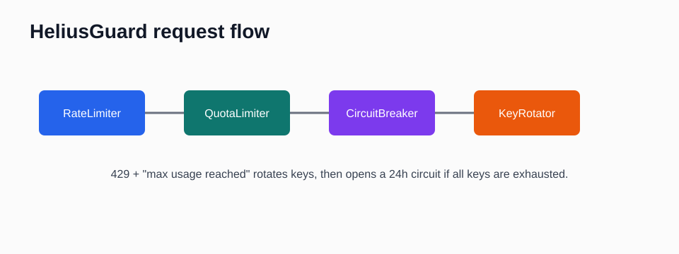

# helius-rate-limiter

Do not burn through Helius quota by accident.



**Helius free is 100k credits per MONTH, not per day.** A `429` body containing
`max usage reached` means monthly exhaustion. The safe default is to rotate to another key
or open a long 24h circuit, while ordinary transient `429`s use short backoff.

## Install

```bash
pip install helius-rate-limiter
```

## 30-second usage

```python
import os
import requests
from helius_limiter import HeliusGuard

keys = [k.strip() for k in os.getenv("HELIUS_API_KEYS", "").split(",") if k.strip()]
guard = HeliusGuard(keys, state_path="helius_state.json")

def call(api_key: str):
    return requests.get(
        os.getenv("HELIUS_URL", "https://api.helius.xyz/v0/example-endpoint"),
        params={"api-key": api_key},
        timeout=20,
    )

response = guard.request(call, credits=1)
```

## Async quickstart

```python
import os

from helius_limiter.aio import AsyncGuard

keys = [k.strip() for k in os.getenv("HELIUS_API_KEYS", "").split(",") if k.strip()]
guard = AsyncGuard(keys, state_path="helius_state.json")

async def call(api_key: str):
    return await your_async_http_client.get(
        os.getenv("HELIUS_URL", "https://api.helius.xyz/v0/example-endpoint"),
        params={"api-key": api_key},
    )

response = await guard.request(call, credits=1)
```

## Decorator quickstart

```python
from helius_limiter import CircuitBreaker, QuotaLimiter, RateLimiter
from helius_limiter.decorators import rate_limited, with_circuit, with_quota

limiter = RateLimiter(rps=10)
quota = QuotaLimiter(max_credits=100_000, state_path="helius_state.json")
circuit = CircuitBreaker()

@rate_limited(limiter)
@with_circuit(circuit)
@with_quota(quota, credits=1)
def call_helius(api_key: str):
    return your_sync_http_client.get(
        "https://api.helius.xyz/v0/example-endpoint",
        params={"api-key": api_key},
    )
```

The same decorators work on `async def` functions when you pass the async primitives from
`helius_limiter.aio`.

## Metrics hook

```python
def on_event(event: str) -> None:
    print(event)

guard = HeliusGuard(keys, on_event=on_event)
```

The callback receives `throttled`, `tripped`, `reset`, and `rotated` events when those guard
or circuit transitions happen. It defaults to `None`.

## Knobs

| Knob | Default |
|---|---:|
| `rps` | `10.0` |
| `monthly_credits` | `100_000` |
| `failure_threshold` | `8` |
| `circuit_open_seconds` | `900` |
| `state_path` | `None` |

Works with `requests`, `httpx`, `aiohttp`, or any object exposing `.status_code`, `.text`,
and `.headers`. You bring the HTTP client.

Powers the on-chain client in **[wallet-cluster-detector](https://github.com/barobaonguyen/wallet-cluster-detector)**.

Built by [barobaonguyen](https://github.com/barobaonguyen). Want the full **scrape -> AI -> alert** bot, not just this piece? → **[Trawlkit](https://github.com/barobaonguyen)** (one-time kit).
